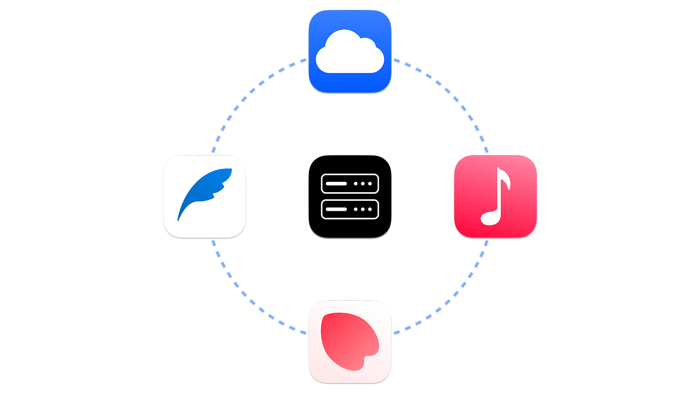

# Amphi Server

[notes]: https://github.com/amphi2024/notes
[music]: https://github.com/amphi2024/music
[photos]: https://github.com/amphi2024/photos
[cloud]: https://github.com/amphi2024/cloud

A simple Minecraft-like self-hosted server for [Amphi Notes][notes], [Music][music], [Photos][photos], and [Cloud][cloud].



## Setup

You can host your server using Java Runtime. If this guide feels complicated, check out our step-by-step [YouTube Tutorial](https://www.youtube.com/@amphi2024).

[//]: # (You can host your server using Java Runtime or Docker. If this guide feels complicated, check out our step-by-step [YouTube Tutorial]&#40;https://www.youtube.com/@amphi2024&#41;.)

[//]: # (### Start with Java)

First, download the server from GitHub Releases.

```bash
curl -L https://github.com/amphi2024/server/releases/download/v?.?.?/server-?.?.?.jar -o server.jar
# Replace ?.?.? with the latest version
```

Initialize the server:
```bash
java -jar server.jar
```

`config.example.yaml` will be generated. Rename it to `config.yaml` and customize your settings.

Run as a Linux Service (Systemd): Create a file at `/etc/systemd/system/your-server.service`:

```ini
[Unit]
Description=My Server
After=network.target

[Service]
Type=simple
User=YOU
WorkingDirectory=/path/to/server
ExecStart=java -jar /path/to/server/server.jar # or path/to/jre/bin/java -jar /path/to/server/server.jar
Restart=on-failure

[Install]
WantedBy=multi-user.target
```

Apply and start:

```bash
sudo systemctl daemon-reload
sudo systemctl enable your-server
sudo systemctl start your-server
```

[//]: # (### Start with Docker)

[//]: # (If you want a containerized server. )

[//]: # (First, pull the image.)

[//]: # (```bash)

[//]: # (docker pull amphi/server:latest)

[//]: # (```)

[//]: # (Then, run the server:)
[//]: # (```bash)
[//]: # (docker run -d \)
[//]: # (  -p 8000:8000 \)
[//]: # (  -v $&#40;pwd&#41;/data:/app/data \)
[//]: # (  -v $&#40;pwd&#41;/config.yaml:/app/config.yaml \)
[//]: # (  --name amphi-server \)
[//]: # (  amphi/server:latest)
[//]: # (```)

### Final Step

To access your server from outside your network, we recommend the following methods:

- Tailscale
- Cloudflare Tunnel
- Ngrok
- Custom Domain with HTTPS

**WARNING**: Ensure your configuration is secure according to your chosen method. Avoid risky methods like direct port forwarding.

## Update

You can easily update the server by replacing the JAR file.

[//]: # (### For Java Users)

```bash
# Stop the Service (for Linux)
sudo systemctl stop your-server

# Rename the old server file
mv server.jar server-old.jar

# Download the latest version
curl -L https://github.com/amphi2024/server/releases/download/v?.?.?/server-?.?.?.jar -o server.jar

# Restart the Service
sudo systemctl restart your-server
```

[//]: # (### For Docker Users)

[//]: # (```bash)

[//]: # ()
[//]: # (```)